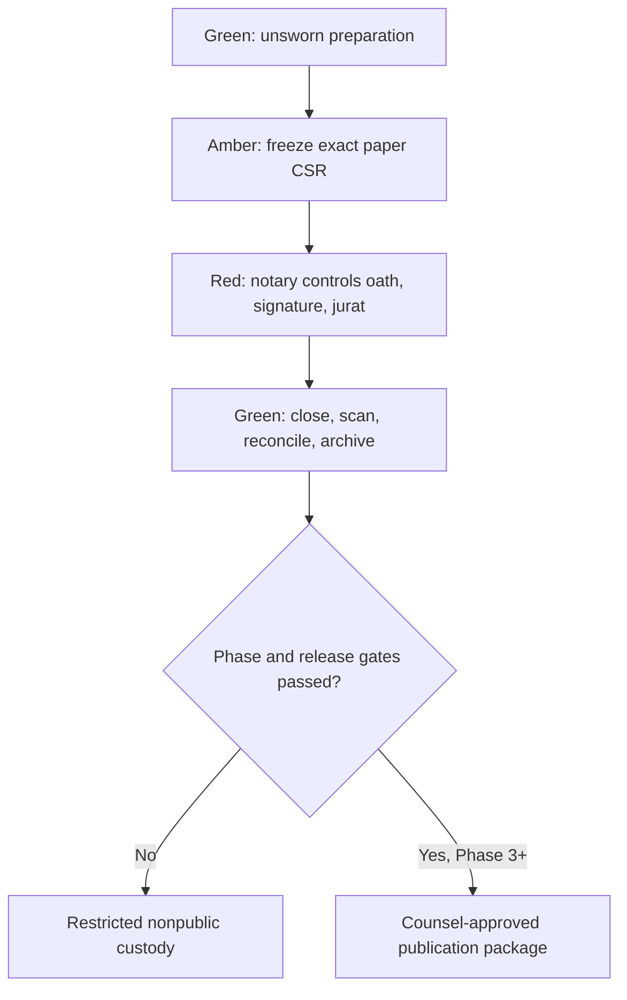

# Digital Ground Game Participant Sworn-Statement Protocol

## Washington candidate v1.1 — controlled research design

**Control date:** August 30, 2026  
**Status:** Phase 0/1 design candidate; not a live form, release, host script, or legal opinion  
**Controlling legal analysis:** `memorandum/WASHINGTON_VOLUNTARY_SWORN_FORMAT_LEGAL_MEMORANDUM_v1.1.md`  
**Pilot posture:** Washington-only, in-person, tangible wet-ink, nonpublic

> **Do not use this protocol with a named public figure.** Washington counsel, media/privacy counsel, election/tax counsel, the commissioned notary, and DGG's independent release authority must approve the exact forms, participants, entity facts, venue, recording, custody, and publication plan first.

## 1. Purpose and nonnegotiable limits

The protocol tests whether a participant-authored, exact, source-linked factual record can improve precision, uncertainty disclosure, provenance, correction, and audience calibration. It does not create a truth-certification service or a prosecutor-controlled proceeding.

Nonnegotiable rules:

1. Participation and every proposition are voluntary.
2. The participant may consult counsel, pause, qualify, say unknown, say not recalled, decline a proposition, or leave.
3. No adverse inference follows from any of those choices.
4. Only the exact numbered propositions expressly adopted in the Canonical Sworn Record (CSR) are sworn.
5. The ordinary interview, commentary, source analysis, and Public Media Record (PMR) are unsworn.
6. The notary certifies the required notarial act—not the factual truth of an answer.
7. DGG does not promise false-swearing or perjury liability, jurisdiction, charging, conviction, arrest, extradition, or immunity through correction.
8. Phases 0 and 1 are nonpublic. No livestream is permitted in any phase.
9. The first pilot uses a tangible wet-ink record; electronic and remote branches are quarantined.
10. The public repository contains only policy, blank forms, synthetic examples, aggregate findings, and redacted audit material—never participant records, releases, ID, journal data, or privileged advice.

## 2. Record architecture

### 2.1 Canonical Sworn Record

The CSR is the paper original containing the participant's exact numbered factual answers, qualifications, adoption, wet-ink signature, and securely attached contemporaneous verification certificate/jurat. It is the only sworn object.

### 2.2 Public Media Record

The PMR is any DGG video, audio, transcript, clip, source explainer, or ordinary interview. It is unsworn. It may not expand the oath by caption, edit, montage, host statement, or proximity.

### 2.3 Source and administration annexes

The source packet, contrary sources, DGG claim assessment, definitions not expressly adopted, invitation logs, manifest, custody receipts, and correction log are **not part of the sworn statement**. Mark that status on every page.

## 3. Authorized scope by phase

| Phase | Authorized activity | Prohibited activity |
|---|---|---|
| 0 — synthetic dry run | Fictional facts, blank/synthetic CSR, incident tabletop, repeated paper/custody tests | Real accusations, named public figures, external publication implying a real statement |
| 1 — nonpublic feasibility | Small adult cohort; all captured people physically in Washington; wet-ink CSR; restricted recording only if consent test requires it | Named publication, remote participant, electronic signing, ordinary PDF notarization, invitee status page |
| 2 — safety/effect studies | Content-matched audience test and separate randomized speaker-process test | Claiming accuracy effects from an audience-only study; public refusal labels before results |
| 3 — limited public pilot | Few pre-disclosed propositions; Washington in-person; complete counsel and release gates | Livestream, prosecution theatrics, truth badge, selective release of misleading excerpts |
| 4 — remote/interstate | New protocol version after January 1, 2027 legal/rules/provider/location review | Reusing v1.1 or assuming a Washington notary creates nationwide criminal jurisdiction |

## 4. Roles and separation of authority

| Role | Controls | Must not control |
|---|---|---|
| Project owner | Budget, phase order, qualified personnel | Individual answers, notarial act, release override |
| Participant | Answer, basis, qualification, adoption, signature, withdrawal choices | Notary certificate or DGG source assessment |
| Participant counsel | Advice and participant-authored language assistance | DGG editorial or notary independence |
| Fact editor | Question admission, source/contrary packet, claim IDs | Drafting a desired sworn answer or declaring criminal guilt |
| Record controller | Version, paper generation, freeze manifest, original custody | Editing substance after freeze or signing for another role |
| Session lead | Consent sequence, room control, stage announcements, stopping | Oath, certificate choice, threats, answer coaching |
| Independent notary | Appearance, identity, capacity/voluntariness judgment, oath, signature, certificate, stamp, journal, refusal | Editorial outcome, truth investigation, campaign role, DGG release decision |
| Production custodian | DGG recording, transcript, access log, derivative custody | Notary journal, ID images, KBA answers, seal credentials |
| Privacy checker | Frame/audio review, redaction, minimization, release checklist | Sole release authority |
| Independent release authority | Phase/publication signoff with counsel | Altering the CSR or overruling a legal/privacy stop |
| Methods reviewer | Preregistration, randomization, metrics, thresholds, null/adverse reporting | Marketing claims unsupported by results |

Required dual approvals:

- record freeze: record controller + independent checker;
- certificate/scan reconciliation: record controller + notary or counsel-designated checker;
- correction classification: counsel + record controller;
- publication: media/privacy counsel + independent release authority; and
- restart after a critical incident: counsel + independent release authority.

## 5. Phase 1 medium and custody design

### 5.1 Tangible original

The first pilot uses preprinted paper with:

- unique record ID and version on every page;
- `Page X of Y` on every page;
- no blank answer space after freeze;
- participant initials on every sworn-payload page;
- a clearly delimited adoption/signature page; and
- a verification certificate securely attached and completed by the notary.

The notary and counsel approve the physical certificate placement. DGG does not precomplete the notary's factual fields or ask a nonlawyer notary to select legal language.

### 5.2 Two-digest manifest

A document cannot straightforwardly contain a hash of its own final bytes, and signing/stamping changes those bytes. Use an external manifest:

1. Generate the final pre-sign PDF used to print the paper CSR.
2. Record SHA-256 of that PDF, record ID/version, generation timestamp, page count, proposition IDs, software/version, and checker identity in a **pre-sign content manifest**.
3. Print from that artifact; reconcile every page before the session.
4. After execution and custody handoff, scan the full paper original in order.
5. Record a second SHA-256 for the **final executed scan**, with scan timestamp, device/process, page count, custodian, and checker.
6. Link both digests in the manifest; never overwrite either.

The pre-sign digest identifies the printable content artifact. The post-sign digest detects changes to the executed scan. Neither proves truth, identity, paper authenticity, or custody by itself. The signed paper remains the canonical legal object.

### 5.3 Original custodian

Before a session, the pilot order identifies the legal custodian of the executed paper original. At close, the notary or record controller transfers it by signed handoff receipt into a sealed or tamper-evident enclosure. The custody log records:

- transfer date/time and location;
- record ID/version and page count;
- transferor and recipient;
- enclosure/seal identifier;
- every later access, reason, person, and return;
- scan event and checker;
- retention/destruction schedule; and
- legal-hold status.

The notary owns and controls the notarial journal. The journal is not the CSR. The notary generally does not retain a CSR image solely because of the notarial act. DGG must not photograph or obtain the journal, ID, address, seal credentials, or other notarial personal information for production.

## 6. Question and proposition admission

A proposition enters the CSR only if every answer is yes:

1. Can evidence establish the proposition as true or false?
2. Does it identify the actor, conduct/condition, and date or period?
3. Are material terms, scope, and exceptions defined neutrally?
4. Can the participant answer from personal knowledge or identified records?
5. Does the form provide unknown, cannot verify, not recalled, qualification, and decline?
6. Has DGG supplied the participant and counsel the exact wording and source/contrary packet in advance?
7. Would DGG use materially the same formulation for a similarly situated person with different politics?
8. Is swearing this proposition more useful than ordinary reporting?
9. Has the fact editor found no known falsity, material contradiction, deceptive ambiguity, or unsupported defamatory implication?
10. Have counsel and the notary approved the proposition's inclusion and workflow?

Any no moves the item to the unsworn lane or removes it.

Prohibited sworn content includes predictions, opinion, moral judgment, motive inference, vague self-characterization, advocacy, compound accusations, facts outside the participant's stated knowledge/record basis, and statements DGG knows are false or materially misleading.

## 7. Minimum CSR schema

### 7.1 Administrative cover — unsworn unless expressly incorporated

- record ID and version;
- date and actual Washington venue/county;
- public participant name/capacity only;
- total pages and sworn-payload pages;
- purpose and voluntariness notice;
- notary-limitation notice;
- exact withdrawal/publication cutoff reference; and
- manifest ID.

### 7.2 Numbered sworn propositions

| Field | Requirement |
|---|---|
| Proposition ID | Stable `P-###` identifier |
| Exact question | One falsifiable proposition with defined time/scope |
| Exact answer | Participant-authored or expressly adopted wording |
| Knowledge lane | Personal knowledge / identified record / qualified basis |
| Qualification | Full text; never hidden in an annex |
| Choice | True / false / unknown / cannot verify / not recalled / decline / qualified answer |
| Incorporated record | Exact source ID/page only if participant deliberately adopts it |

Source annotations and DGG truth assessments are placed outside the sworn payload.

### 7.3 Adoption

Counsel must approve the exact language. At minimum it must identify:

- record ID/version;
- exact sworn pages and proposition IDs;
- that the participant read or had the record read, understood, and deliberately adopted those propositions as qualified;
- that no DGG source annotation or later media commentary is adopted; and
- participant signature/date made in the notary's presence.

Avoid a generic oath covering “everything said in the interview.”

### 7.4 Verification certificate

Use the counsel-selected Washington verification/jurat form, not a mere acknowledgment or signature-witnessing certificate. It is completed contemporaneously under the notary's exclusive control and securely attached to the tangible CSR.

## 8. Consent and privacy gate

### 8.1 Layered written consent before capture

Before anyone enters a recording-controlled room, obtain signatures addressing separately:

1. audio/video communication;
2. any notarial recording/retention requirement;
3. DGG production recording;
4. transcript, caption, translation, and specified AI tools;
5. editing that does not materially alter meaning;
6. publication, excerpts, thumbnails, promotion, and syndication;
7. source packet and correction linkage;
8. retention, security, legal hold, and valid legal process;
9. whether and until when authorization may be withdrawn; and
10. optional uses such as fundraising or advertising—never bundled by silence.

Disable automatic recording, transcription, meeting summaries, cloud AI, and analytics until the approved consent condition is satisfied.

### 8.2 Recorded opening

If DGG records, the session lead makes a clear recorded announcement and obtains an affirmative confirmation from each participant, notary, interpreter, interviewer, and crew member. Pause if anyone enters and repeat the process. A late joiner never inherits another person's consent.

### 8.3 Notarial privacy blackout

Identity documents, addresses, journal pages/signatures, KBA or credential analysis, seal credentials, and any other sensitive notarial data remain outside production video and audio. The privacy checker confirms camera framing and microphone treatment before the red zone. If sensitive information is captured, stop, quarantine the file, notify counsel/privacy lead, and do not resume on the same recording unless the incident is contained and approved.

## 9. Pre-session gates

### 9.1 Pilot order

The project owner signs a written order specifying:

- phase and nonpublication rule;
- all people and roles;
- confirmation that every captured person will be physically in Washington;
- actual venue/county;
- tangible wet-ink medium;
- notary name, commission status, fee, payer, conflict screen, and journal practice;
- record ID/version and approved propositions;
- consent/release versions;
- custodian, retention, legal hold, and incident owner;
- prohibited public claims;
- applicable counsel approvals; and
- stop/restart authority.

### 9.2 Entity and publication gate

Before Phase 3, counsel must verify the operating entity, EIN/status records, funding, campaign contacts, requests/material involvement, fair-market value, distribution, press/editorial structure, insurance, tax treatment, recording/release, and applicable campaign reporting/disclaimers. A website self-description is insufficient.

### 9.3 Notary gate

Verify and log:

- active Washington commission through DOL;
- independence beyond minimum statutory conflict rules;
- actual Washington physical presence and venue;
- tangible-record procedure and certificate;
- agreed statutory fee and separately disclosed, pre-agreed actual travel/copying costs;
- willingness to refuse or stop independently;
- journal and privacy procedure; and
- no DGG production demand for the journal, ID, or notary credentials.

## 10. Controlled session sequence

### Green 1 — room and consent

1. Lock room access and confirm every role/person.
2. Confirm signed consent before any capture.
3. If recording, make and record the approved announcement and confirmations.
4. Explain the unsworn/sworn boundary, voluntary choices, counsel access, and no-inference rule.
5. Confirm no livestream, automatic transcription, or unapproved AI process.

### Green 2 — participant preparation

6. The participant and counsel review every proposition and source/contrary item.
7. The participant authors or expressly adopts each answer and qualification.
8. The fact editor runs the admission test and raises any ambiguity or contradiction.
9. Mandatory counsel hold applies to a known/probable falsity, material inconsistency, defamatory implication, inadequate basis, coercion concern, or scope defect.
10. The notary does not draft answers or legal language.

### Amber — freeze

11. Generate the final pre-sign PDF and external manifest.
12. Print and independently reconcile version, pages, proposition IDs, answer completeness, and certificate attachment.
13. The participant confirms the paper record is final and identifies any last correction.
14. Both freeze checkers sign the manifest.
15. No substantive discussion or content change occurs after freeze. A change returns the process to Green and produces a new version.

### Red — independent notarial act

16. The session lead yields control to the notary.
17. Production enters the approved privacy blackout for identity and journal work.
18. The notary independently determines whether to proceed, verifies identity/signature as required, and addresses capacity/voluntariness concerns.
19. The notary identifies the exact record ID/version, page range, and proposition IDs.
20. The participant deliberately takes the counsel-approved oath or affirmation and signs in the notary's presence.
21. The notary completes, signs, dates, and stamps the verification certificate contemporaneously and makes the required journal entry.
22. Any wrong version, pre-signature, precompleted jurat, identity doubt, page defect, substantive variation, or interruption aborts the act. Quarantine the record; do not “fix” it after the fact.

### Green 3 — close and reconcile

23. The notary declares the notarial act complete.
24. The host states that the sworn segment is over and all later conversation is unsworn.
25. Transfer the original using the custody receipt.
26. Scan and independently reconcile the full executed original; compute the executed-scan digest.
27. Review certificate, page order, initials, manifest, custody, privacy, and incident logs.
28. **Close, quality-check, and archive.** Phases 0 and 1 do not publish.

## 11. Mandatory stop conditions

Anyone may request a pause. The session lead, notary, counsel, privacy checker, record controller, and independent release authority each have unilateral stop power within their domain.

Stop immediately if:

- phase, medium, record version, venue/county, identity, consent, role, custody, or counsel approval is unresolved;
- any captured person is outside Washington or participates remotely;
- capture began before the approved consent condition;
- an unapproved device, transcription, AI, stream, or recording is active;
- the notary is conflicted, not authorized, not physically present, uncertain, or not in control;
- a proposition is materially ambiguous, internally contradictory, known/probably false, defamatory, outside scope, or outside the participant's asserted basis;
- the participant appears pressured, confused, unable to understand, or wants counsel/a break/withdrawal;
- content changes after freeze, pages differ, the wrong version appears, a signature predates the act, or the jurat was precompleted;
- ID or journal information enters production capture;
- chain of custody, scan reconciliation, certificate, stamp, page count, or manifest fails;
- a legal demand, security/privacy event, campaign/coordination issue, or publication error appears; or
- a numeric Phase 2 safety gate or zero-tolerance event fails.

Resume requires written incident disposition, a clean replacement record/recording when applicable, and approval from counsel and the independent release authority. Never resume by editing the failed object.

## 12. Corrections and contested accuracy

### 12.1 Before the notarial act

Return to Green, revise under participant control, increment the version, regenerate the manifest, and repeat freeze.

### 12.2 During the notarial act

Stop. Do not interline, white-out, substitute a page, or orally vary the frozen CSR. Quarantine it and restart with a new version and complete new act.

### 12.3 After execution but before publication

Preserve the original under restricted access. A substantive correction requires a new CSR/version and a complete new oath, signature, certificate, journal entry, manifest, and custody chain. Counsel decides what provenance must later be disclosed. Never promise a statutory retraction defense.

### 12.4 After publication

Use exactly one classification:

1. **Administrative/transcription notice:** append-only correction outside the executed CSR; no claim that the CSR changed.
2. **New sworn CSR:** complete new record and full new notarial act linked to the superseded record.
3. **Expressly unsworn participant note:** clearly labeled, signed if desired, but never described as sworn.

Promptly annotate or disable misleading derivatives. Preserve the executed original internally under legal hold. Media counsel decides whether a known-false or potentially defamatory public copy remains accessible, becomes restricted, or is replaced by a provenance stub. Preservation does not require continued republication.

## 13. Publication rules

### 13.1 Phase gate

Phases 0 and 1 permit no named participant publication. Phase 2 may publish preregistered methods and aggregate, synthetic, null, and adverse findings. A named package begins only in Phase 3 after all case-specific gates.

### 13.2 Complete package

When authorized, publish together:

- an access-safe scan of the complete CSR and certificate;
- record ID/version, manifest ID, executed-scan digest, and change log;
- the exact adopted propositions in machine-readable form;
- source packet and strongest contrary sources, clearly unsworn;
- enough PMR context to prevent a misleading edit;
- participant-approved qualifications and correction links;
- method, invitation criteria, funding/sponsor disclosures, and limitations; and
- the notary-limitation/no-inference notice adjacent to every display and derivative.

Approved core notice:

> The participant signed the identified statements under oath before a Washington notary. The notary certified the required notarial act; the notary did not investigate or certify factual truth. Participation and every proposition were voluntary. No inference about honesty should be drawn from declining, qualifying, saying unknown, correcting, or not participating.

### 13.3 Status controls

Do not publish identified invitee/nonparticipant pages or comparison statuses until Phase 2 demonstrates that the exact copy does not create a material dishonesty inference. Even then, report only a documented event and place the no-inference notice with equal prominence.

Never use:

- “perjury interview,” “notary-verified truth,” or “certified true”;
- “refused to tell the truth,” “failed the oath,” or “would not risk perjury”;
- red/green credibility badges, honesty scores, rankings, or leaderboards;
- automatic-liability, prosecution, extradition, or immunity claims; or
- a claim that science proves the format makes politicians truthful.

## 14. Evaluation and release gates

Phase 2 must preregister two separate studies:

### Audience-safety study

Hold content constant while varying format labels and visual presentation. Co-primary outcomes:

- comprehension that the notary did not certify truth;
- calibrated confidence against independently adjudicated facts;
- false truth-certification belief;
- dishonesty inference from nonparticipation/qualification/correction;
- partisan interaction; and
- willingness to inspect sources/corrections.

### Speaker-process study

Randomize the process exposure separately. Outcomes:

- objective proposition accuracy under an independent adjudication rubric;
- qualification, unknown, not-recalled, and decline rates;
- source citation and basis quality;
- ambiguity/evasion;
- immediate/later correction;
- perceived coercion and participation; and
- treatment fidelity.

Predefine estimands, randomization unit, speakers/items, clustering, counterbalancing, manipulation checks, coding reliability, attrition, multiplicity, equivalence margins, power, security, retention, and publication of null/adverse results.

Provisional Phase 3 gates, subject to independent statistical review:

- at least 90% correct notary-role comprehension;
- no practically meaningful increase in false truth-certification belief versus content-matched control;
- no practically meaningful dishonesty inference from exact proposed status copy;
- no material partisan administration or audience interaction;
- zero critical consent, privacy, wrong-record, custody, livestream, or overwrite events; and
- a prespecified benefit in accuracy or calibration without failure of a co-primary safety outcome.

## 15. Repository and traceability rules

Every public policy or research update must include:

- matter/work-item ID;
- claim/proposition/source IDs affected;
- exact source URL, authority status, proposition supported, limitations/adverse reading, and check date;
- changed document paths;
- input and output SHA-256 values where appropriate;
- Git branch, pull request, and final commit;
- reviewer and counsel-gate status; and
- correction links rather than overwritten history.

The public repository must never hold real participant CSR/PMR files, releases, invitations, identities, journal information, internal incident reports, privileged legal advice, unpublished source material, or security credentials.

## 16. Phase 0 exit checklist

- [ ] Exact paper CSR, adoption, and verification certificate approved by Washington counsel.
- [ ] Independent notary approves the workflow and remains free to refuse.
- [ ] Participant notice and layered consents approved.
- [ ] Source/contrary packet and proposition-admission rubric tested.
- [ ] Pre-sign manifest and executed-scan digest process passes repeated reconciliation.
- [ ] Original custodian, handoff, access log, retention, destruction, and legal hold documented.
- [ ] Camera/audio privacy blackout prevents ID/journal capture.
- [ ] Wrong-version, post-freeze change, known-falsity, correction, demand-letter, and campaign-issue tabletops pass.
- [ ] Entity, election, tax, media, privacy, insurance, and funding facts are documented for any Phase 3 plan.
- [ ] Evaluation design and numeric gates receive independent methods review.
- [ ] No public-facing language implies truth certification, automatic liability, or adverse inference.
- [ ] Repository readback confirms only approved public materials and immutable input archives.

Failure of any checkbox keeps the project in Phase 0.

---

## Controlling legal references

- [Chapter 42.45 RCW — notarial acts](https://app.leg.wa.gov/rcw/default.aspx?cite=42.45&full=true)
- [RCW 5.28.010 — officers authorized to administer oaths](https://app.leg.wa.gov/RCW/default.aspx?cite=5.28.010)
- [Chapter 9A.72 RCW — false swearing and perjury](https://app.leg.wa.gov/rcw/default.aspx?cite=9A.72&full=true)
- [Chapter 308-30 WAC — notary rules](https://app.leg.wa.gov/wac/default.aspx?cite=308-30&full=true)
- [RCW 9.73.030 — recording consent](https://app.leg.wa.gov/RCW/default.aspx?cite=9.73.030)
- [Chapter 63.60 RCW — personality rights and exemptions](https://app.leg.wa.gov/rcw/default.aspx?cite=63.60&full=true)
- [SHB 2158 bill report — future remote changes effective January 1, 2027](https://lawfilesext.leg.wa.gov/biennium/2025-26/Htm/Bill%20Reports/House/2158-S%20HBR%20PL%2026.htm)

**Use rule:** If this protocol conflicts with counsel's written case-specific direction or current law, stop and follow counsel/current law. Record the supersession in the audit log; do not silently edit an executed record.
